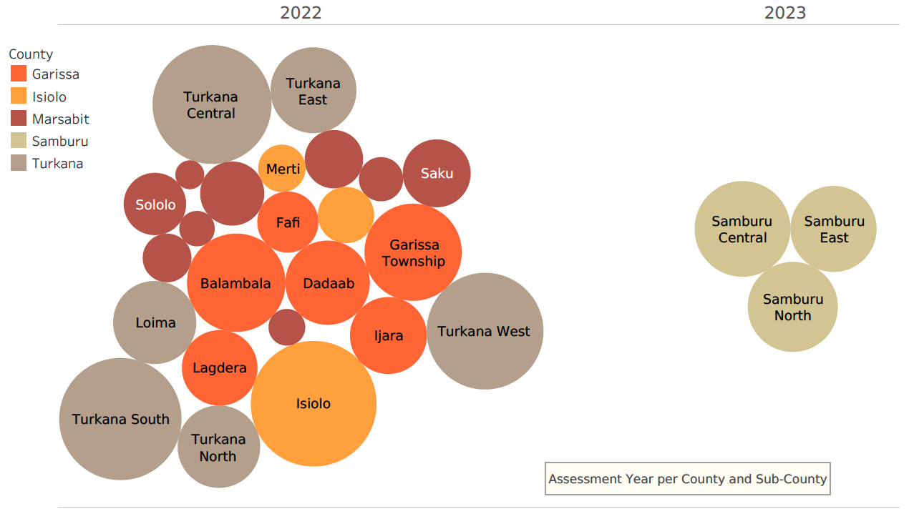

## Analysing and Evaluating Mobility in Northern Kenya

The project's aim is to identify the key factors influencing mobility in the North of Kenya. And specifically observe the role water scarcity plays in the region. With a multi-feature target, the analysis is done by applying unsupervised learning.

**BACKGROUND:** The ASAL region of Kenya has endured three severe droughts in the last decade (2010-2011, 2016-2017 and 2020-2022). The most recent drought (2020 - 2022) has also been the most severe and longest with widespread livelihood losses and massive displacement of populations.

**PROCESS:**

The dataset is based on in-situ surveys carried out in five counties in Northern Kenya in 2022-23 organized by United Nations Office for the Coordination of Humanitarian Affairs (OCHA). In order to combine the datasets, I previously standardized in Excel the questions across the five surveys. Additionally, I deleted (majorily) empty columns, columns that don't exist across all five datasets, and columns with identical/highly similar information. I also divided columns with more than one data point per cell in the respective amount of individual cells.

The original datasource: https://data.humdata.org/dataset/kenya-displacement-baseline-multi-sectoral-location-assessment-iom-dtm

The data analysis involved extensive cleaning of the dataset derived from the five surveys. The final dataset contains 861 entries (=locations with differing number of households) and 48 features. The machine learning algorithm applied is KMeans for clustering and involves Principal Component Analysis (PCA). 
During PCA, 10 features were identified to weight most allowing to identify specific drivers for mobility and displacement in the region.

Find a Tableau Story visualizing the main findings here: 
https://public.tableau.com/views/AnalysisofMobilityandDisplacementinNorthernKenya/STORY?:language=en-US&:display_count=n&:origin=viz_share_link

**SUMMARY OF FINDINGS:**
    
1. In one third of locations (village unit or urban settlement/town) in the region surveyed, only 25% of inhabitants have access to cooking water, the same applies to drinking water.
2. In on average 40% of locations, inhabitants have a water source distance of 50 minutes and additionally experience a water queue time of 50 minutes, possibly indicating a scarcity of water sources and higher demand. 
3. Drought is the dominant reason for departure from locations, reported in a significant 793 areas (around 90% of locations). This further emphasizes the critical role of water availability in these communities. Followed by the second most common reason for departure, resource-based conflict in approx. 75% of locations, indicates significant struggles over resources, likely including water.
4. The reason for abandoning pastoralism reveals vital information about regional issues. The leading reason in about one third of areas is resource-based conflict, followed closely by lack of water and pasture.
5. The primary reason for returning to their original locations reported in 381 of 861 areas is drought, indicating a severe lack of water sources in the areas they moved to.
6. Environmental challenges was reported as the first challenge in approx. 50% of locations, which likely include issues related to water availability and quality. 
7. The second most reported challenge across locations is lack of food and water (ca. 30% of areas), suggesting issues of food and water scarcity are prevalent. Safety and security, reported in 196 locations, may also be indirectly tied to resource scarcity leading to conflicts.

In summary, the most impactful features, based on their weights in the first three principal components, highlight water accessibility, both for drinking and cooking, as well as the broader challenges that water scarcity can present, such as drought, resource-based conflicts, and abandonment of traditional livelihoods like pastoralism.

Based on the current analysis, all of the 10 features can be directly or indirectly associated with water scarcity under certain conditions.  
**Hence, 100% of the factors can be linked to water scarcity.**

Features such as ethnic clashes, safety concerns or access to an educational facility appear to be less important drivers for mobility in the region. However, a more detailed analysis e.g. of additional features in the dataset could provide a more accurate picture of the individual motivation for mobility at a specific point in time. It can help to better understand the underlying causes of these issues and suggest effective interventions.
